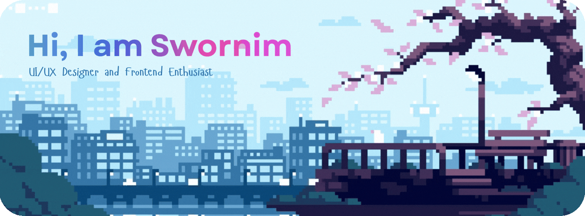

  

<h3 align="center">About Me</h3>

- 🔭 I’m currently working on **refining my UI/UX workflow**
- 🌱 I’m currently learning **Advanced React & Animation Libraries**
- 👯 I’m looking to collaborate on **Creative Interface Designs**
- 📫 Reach me at: **swornim20rks@gmail.com**
- ⚡ Fun fact: **My Github is getting greener, but Figma is where my heart (and most of my hours) live.**

<h3 align="center">Design & Creative Tools</h3>

  

<h3 align="center">Development Tech Stack</h3>

  

<h3 align="center">Activity Overview</h3>

  

<h3 align="center">Connect with me:</h3>

  

